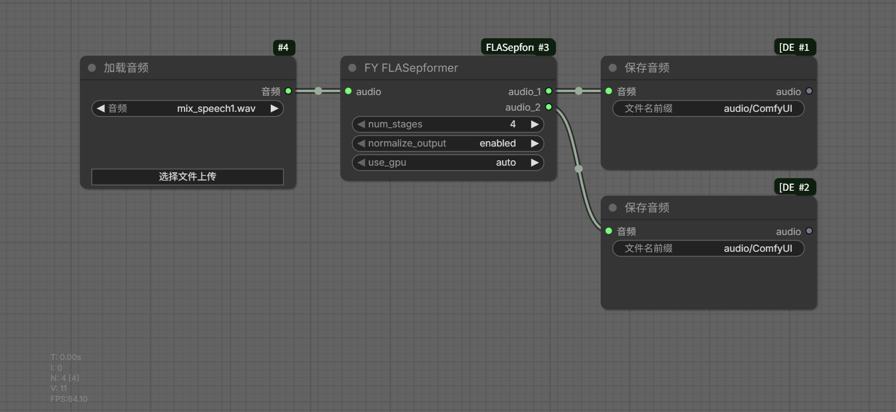

# ComfyUI-FLASepformer

> 📖 [中文文档](README_CN.md)

ComfyUI node for FLASepformer speech separation by Alibaba DAMO Academy, splits dual-speaker mixed audio into two independent tracks.

---

## Introduction

**FLASepformer** is a highly efficient monaural speech separation model specifically designed for long speech sequences. It takes a mixed speech signal containing two speakers as input and separates it into two distinct, independent speaker streams.

This plugin wraps the FLASepformer model into a ComfyUI node, supporting:
- Input audio of any sample rate and channel count, automatically resampled to 8kHz mono
- Two independent speaker outputs (8kHz mono)
- GPU (CUDA / ROCm) and CPU inference
- Adjustable separation stages (4 / 6 / 8) and output normalization

### Model Specs

| Item | Value |
|------|-------|
| Model Name | speech_flatsepreformer_separation_temporal_8k_base_libri2mix100 |
| Architecture | FLA-SepReformer-B (time-domain only) |
| Training Data | Libri2Mix-100 |
| Input | 8kHz mono mixed speech |
| Output | 2 × 8kHz mono independent speech |
| ONNX Opset | 17 |
| License | CC BY-NC 4.0 (non-commercial academic use) |

### Node Parameters

| Parameter | Options | Default | Description |
|-----------|---------|---------|-------------|
| `num_stages` | 4 / 6 / 8 | 4 | Number of separation stages; more stages = better quality but slower inference |
| `normalize_output` | enabled / disabled | enabled | Output normalization to prevent clipping (peak scaled to 0.5) |
| `use_gpu` | auto / cpu / gpu | auto | Inference device (auto detects available GPU) |

---

## Workflow Example



Workflow description:
1. Input audio (any format/sample rate) connects to the `FY FLASepformer` node
2. The node outputs `audio_1` and `audio_2` — two separated speaker tracks
3. Each output connects to a `SaveAudio` node to save as independent audio files

---

## File List

```
ComfyUI-FLASepformer/
├── __init__.py          # Plugin entry point, model path & ONNX session management
├── nodes.py             # FY_FLASepformer node implementation
├── requirements.txt     # Dependency declaration (no extra packages needed)
├── workflows/
│   ├── workflow.png     # Workflow screenshot
│   └── workflows.json   # ComfyUI workflow file
└── temp/                # Runtime temp directory (auto-created)
```

---

## Model Download & Placement

### Placement Path

The plugin will auto-detect the model at this path and download it automatically if missing:

```
ComfyUI/models/diffusers/speech_flatsepreformer_separation_temporal_8k_base_libri2mix100/
└── onnx_model.onnx
```

### Auto-Download

On first use, the plugin **automatically checks** for the model file:
1. If `onnx_model.onnx` exists, it loads directly
2. If missing, it tries **ModelScope CLI** first
3. If ModelScope fails, it falls back to **HuggingFace CLI**
4. If both fail, it raises an error with manual download links

> No manual download needed — the plugin handles model retrieval on first run automatically.

---

## Dependencies

This plugin requires no additional Python packages. All dependencies are included in ComfyUI's built-in Python environment:

| Package | Version |
|---------|---------|
| onnxruntime | ≥ 1.23.2 |
| soundfile | ≥ 0.12.1 |
| torch | ≥ 2.13.0+rocm10.0.0 |
| torchaudio | ≥ 2.11.0.2+rocm10.0.0 |
| numpy | ≥ 2.5.1 |

---

## Notes

1. **Input audio**: Any sample rate and channel count is accepted; the plugin handles resampling and mono conversion automatically. Pure silence input may cause inference issues.
2. **Output sample rate**: Fixed at 8000 Hz mono. Use a different model if higher audio quality is needed.
3. **Speaker order**: The output speaker order is not fixed; the same speaker may appear on different output channels across different audio clips.
4. **Limitations**: The model performs best on clean dual-speaker speech. Performance may degrade in noisy, reverberant, or music/vocal environments.
5. **License**: The model is licensed under CC BY-NC 4.0 — non-commercial academic use only.

---

## Acknowledgements

- **Alibaba DAMO Academy (Tongyi Lab)**: FLASepformer model and ONNX export
- Paper: [FLASepformer: Efficient Speech Separation with Gated Focused Linear Attention Transformer](https://www.isca-archive.org/interspeech_2025/wang25j_interspeech.html), Interspeech 2025

```bibtex
@inproceedings{wang25j_interspeech,
  title     = {{FLASepformer: Efficient Speech Separation with Gated Focused Linear Attention Transformer}},
  author    = {Haoxu Wang and Yiheng Jiang and Gang Qiao and Pengteng Shi and Biao Tian},
  year      = {2025},
  booktitle = {{Interspeech 2025}},
  pages     = {1468--1472},
  doi       = {10.21437/Interspeech.2025-1315},
}
```
